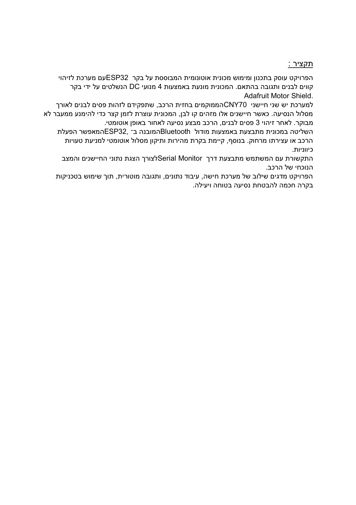
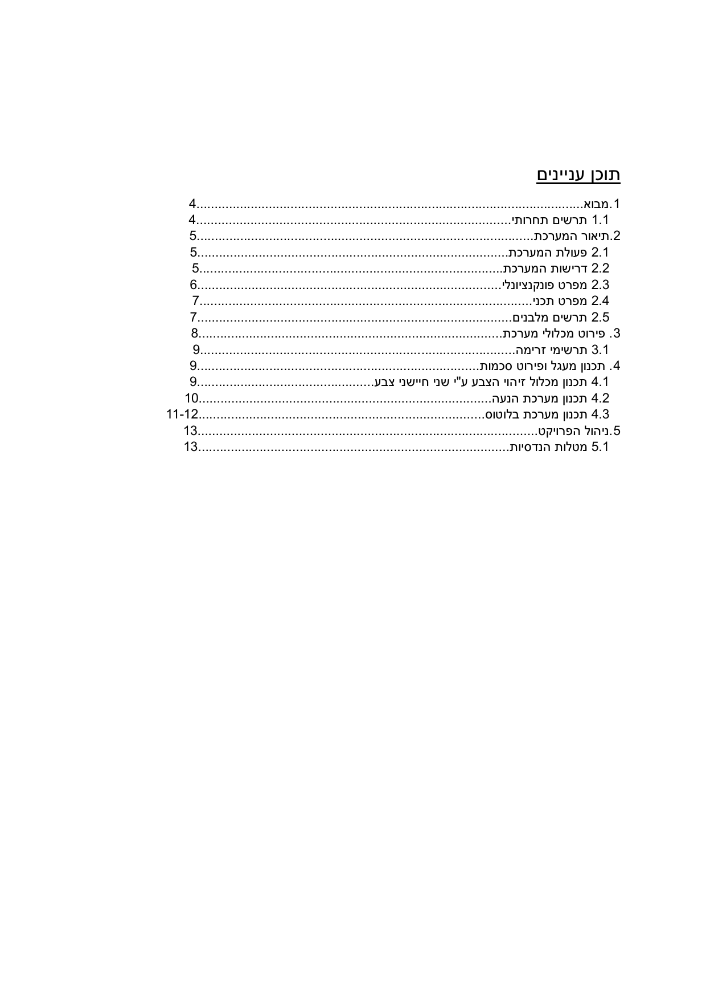
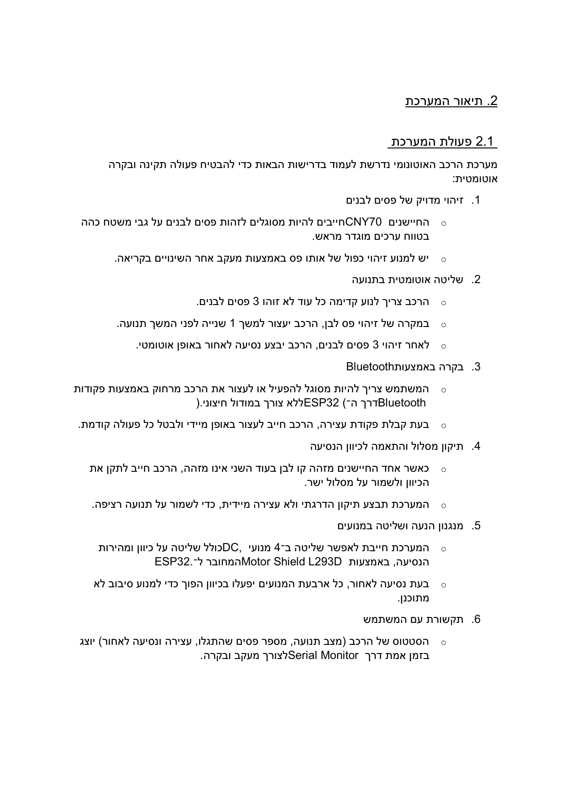
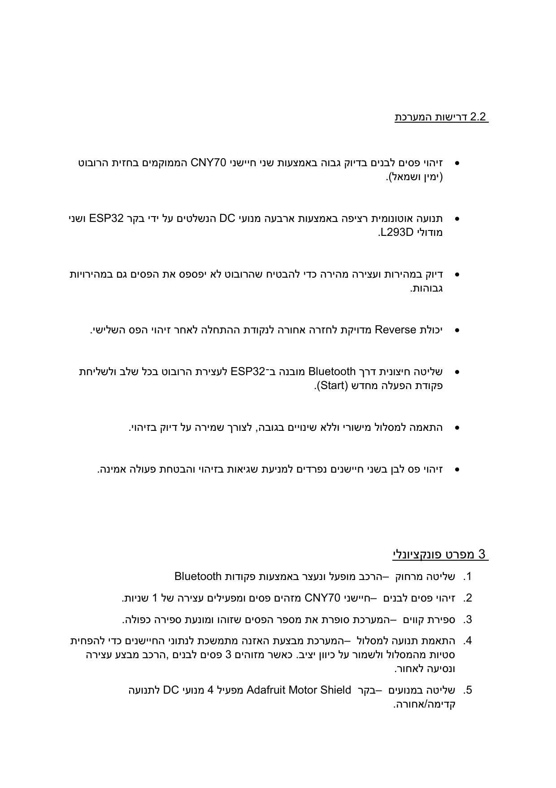

# ESP32 Competitive Robot Control System

## Overview

Autonomous and Bluetooth-controlled robot project using ESP32, CNY70 line sensors, DC motors, and an L293D/Adafruit motor driver.

## Technical Highlights

- Line detection with CNY70 sensors.
- Autonomous route logic with reversing/recovery behavior.
- Bluetooth commands for manual control.
- DC motor direction and speed control through motor driver hardware.
- Serial-monitor feedback for debugging and status.

## Tech Stack

ESP32, Bluetooth, CNY70, DC Motors, L293D, Embedded Control

## Results

- Robot design supports autonomous path execution and remote Bluetooth control.
- Three-sensor line logic enables route following and corrective steering.
- Motor shield drives four DC motors from ESP32 control signals.

## How to Run or Review

- Review rendered project pages in `assets/images`.
- Use the summary as the public technical description.

## Repository Notes

- This repository is prepared as a clean public GitHub portfolio version.
- Original course reports that contain student IDs or private details are not committed.
- The committed material focuses on source code, safe visuals, result screenshots, and a technical summary.

## Visuals

## Full Project Package

This repository now includes the complete public project package:

- `docs/full_report_redacted.md` - full technical report text with private identifiers removed.
- `assets/full_report_media/` or `assets/full_report_pages/` - report figures/pages where available.
- Project source/configuration folders where the original project included runnable code or design files.

Original raw report archives are not committed because they can contain private student metadata in covers, headers, or document properties.

## Public File Coverage

See `docs/public_file_coverage.md` for the complete list of public-safe project files included and the raw/private material intentionally excluded.
